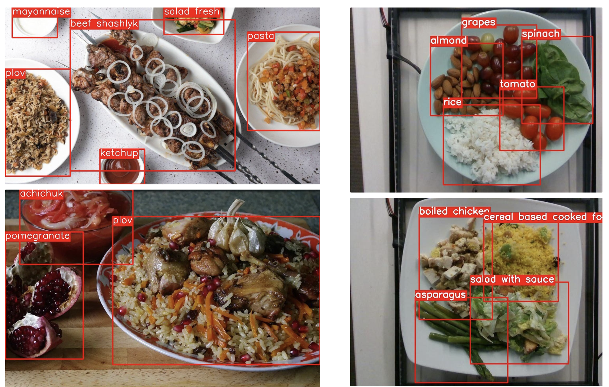
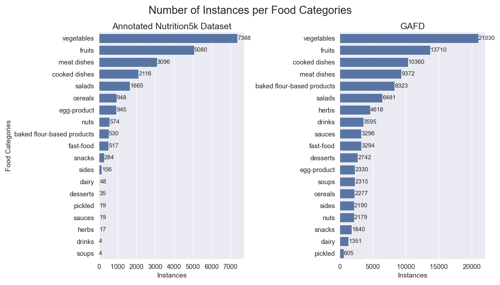

# Global Food Scenes Dataset

In this work, we propose the Global Food Scenes Dataset, a followup of our previous work Central Asian Food Scenes Dataset (CAFSD) combined with Nutrition5k dataset[1] annotated with bounding boxes. 
The Nutrition5k contains 3.5k datasets taken from overhead angle
We annotated the Nutrition5k dataset with bounding boxes resulting in 12,839 images across 113 classes. 

The final combined dataset which we call Global Food Scenes Dataset contains 34,145 images across 241 food classes. Some visual examples of a few classes are shown for the annotated Nutrition5k and CAFSD datasets in the figure below. 

_The images in the right-hand side are sampled from the annotated Nutrition5k dataset whereas left images are from the CAFSD.
_

The table below shows the number of images per split across different datasets.
| Dataset | Train  | Valid | Test |
|---------|--------|-------|------|
| CAFSD   | 17,046 | 2,084 | 2,176|
| Google  | 10,257 | 1,272 | 1,310|
| GFSD    | 27,303 | 3,356 | 3,486|

The statistics of classes grouped into 18 coarse categories are shown in Figure below.

In this Github repo, you can find everything used in this project including training scripts, data preparation scripts, datasets, pre-trained models, and so on.

## Project Files

The project directory contains the following files and directories:

- `figures/`: Directory containing figures and images used in the project.
- `README.md`: This file. Contains information about the project.
- `coco_to_yolo.py`: Script to convert annotations from COCO format to YOLO format.
- `map_labels_yolo.py`: Script to map and update the labels for the YOLO dataset.
- `split_data.py`: Script to split the dataset into training, validation, and test sets.
- `train_rtdetr.py`: Script to train the RT-DETR (Real-Time Detection Transformer) model.
- `train_yolo.py`: Script to train the YOLO (You Only Look Once) model.

# Download Datasets and Pre-trained models
All dataset files and different models pre-trained on different datasets are available for download.   
To download the Global Food Scenes Dataset (GFSD): https://issai.nu.edu.kz/wp-content/themes/issai-new/data/models/GFSD/GFSD.zip  
To download the annotated Nutrition5k dataset: https://issai.nu.edu.kz/wp-content/themes/issai-new/data/models/Nutrition5k/Nutrition5k.zip  
YOLOv8n model trained on the annotated Nutrition5k dataset: https://issai.nu.edu.kz/wp-content/themes/issai-new/data/models/Nutrition5k/yolov8n.pt  
YOLOv8s model trained on the Global Food Scenes Dataset (GFSD): https://issai.nu.edu.kz/wp-content/themes/issai-new/data/models/GFSD/yolov8s.pt  
RT-DETR-x model trained on the Central Asian Food Scenes Dataset (CAFSD): https://issai.nu.edu.kz/wp-content/themes/issai-new/data/models/CAFSD/rtdetr-x.pt  

## Test Set Results Add Test Set Results

| Model Size   | CAFSD (mAP50) | CAFSD (mAP50-95)  | Nutrition5k (mAP50)| Nutrition5k (mAP50-95)| GFSD (mAP50)| GFSD (mAP50-95)|
|-------------------------|-------------------|--------------|---------------|--------------|---------------|------------------------|
| YOLOv8n                 | 0.57              | 0.487        | 0.775         | 0.673        | 0.615                 | 0.529         |
| YOLOv8s                 | 0.612             | 0.529        | 0.781         | 0.688        | 0.668                 | 0.584         |
| YOLOv8m                 | 0.652             | 0.576        | 0.787         | 0.711        | 0.698                 | 0.621         |
| YOLOv8l                 | 0.659             | 0.586        | 0.802         | 0.724        | 0.712                 | 0.635         |
| YOLOv8xl                | 0.677             | 0.601        | 0.797         | 0.717        | 0.714                 | 0.641         |
| RT-DETR-l               | 0.637             | 0.566        | 0.74          | 0.659        | 0.675                 | 0.597         |
| DETR                    | 0.502             | 0.397        | 0.659         | 0.492        | 0.535                 | 0.416         |
| **RT-DETR-x freeze=6**  | **0.685**         | **0.613**    | **0.768**     | **0.688**    | **0.711**             | **0.637**     |

## References
[1] Thames, Q., Karpur, A., Norris, W., Xia, F., Panait, L., Weyand, T., & Sim, J. (2021). Nutrition5k: Towards automatic nutritional understanding of generic food. In *Proceedings of the IEEE/CVF Conference on Computer Vision and Pattern Recognition* (pp. 8903–8911).
